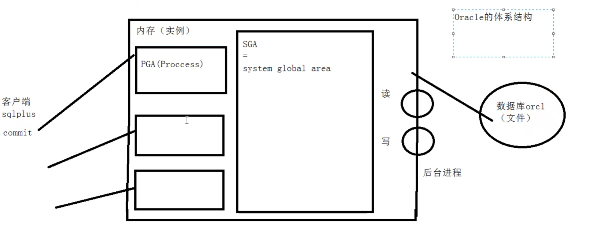
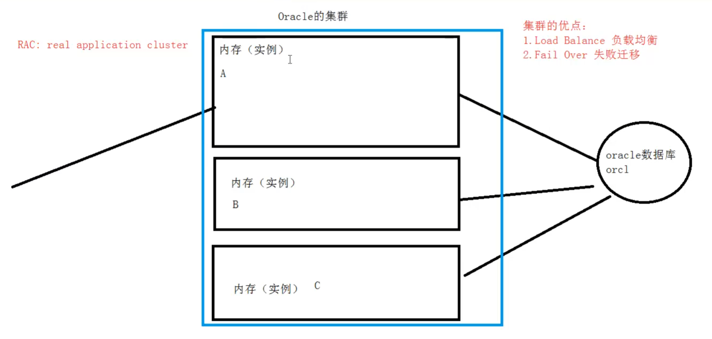

+++
date = '2026-08-02T20:18:07+08:00'
draft = false
tags = ["VMware虚拟机","数据库"]
categories = ["技术"]

title = 'Oracle Plsql 程序设计'


+++

PL/SQL  

结构化查询语言的过成化语言扩展

Procedural Language extensions to the Structured Query Language


## Windows 上用 Docker 部署 Oracle 19c

好的，我们开始配置。在 Windows 上用 Docker 部署 Oracle 19c，核心思路是：**在 Docker 中拉取一个官方或可靠的镜像，然后运行一个配置好的数据库容器。**

整个过程可以分解为以下四个主要步骤。

### 📋 第一步：准备工作

在开始之前，请确保你的 Windows 系统满足以下条件：

1.  **安装 Docker Desktop**：访问 [Docker 官网](https://www.docker.com/get-started/)下载并安装 Docker Desktop for Windows。
    *   **系统要求**：如果你的系统是 **Windows 专业版或更高版本**，安装会比较顺利。如果是**家庭版**，可能需要手动启用 Hyper-V 和 WSL，可以参考一些社区的教程。
2.  **启动 Docker**：安装完成后，启动 Docker Desktop。你可以在任务栏托盘中看到 Docker 的图标，表示它正在运行。
3.  **验证安装**：打开命令提示符 (CMD) 或 PowerShell，运行以下命令来验证 Docker 是否安装成功：
    ```bash
    docker --version
    ```
    如果能看到 Docker 的版本信息，说明安装成功。

### 🐳 第二步：获取 Oracle 19c Docker 镜像

获取镜像有两种主要途径，推荐第一种，因为它更简单快捷。

#### 途径一：使用社区镜像（推荐，最简单）

对于初学者，使用第三方构建好的、稳定的镜像可以省去很多麻烦。参考多个教程，推荐使用阿里云镜像仓库中的 `registry.cn-hangzhou.aliyuncs.com/zhuyijun/oracle:19c`。

在命令行中执行以下命令来拉取镜像：
```bash
docker pull registry.cn-hangzhou.aliyuncs.com/zhuyijun/oracle:19c
```
这个镜像大小约为 3.69 GB，下载需要一些时间，请耐心等待。

#### 途径二：使用 Oracle 官方镜像（更权威，步骤稍多）

如果你想使用官方镜像，可以访问 Oracle Container Registry。

1.  **登录**：你需要在 Oracle 官网注册一个免费账户，并创建一个 **Auth Token**（身份验证令牌）。然后在命令行中登录：
    ```bash
    docker login container-registry.oracle.com
    ```
    输入你的用户名和 Auth Token。
2.  **拉取镜像**：登录成功后，执行以下命令拉取官方 19c 企业版镜像：
    ```bash
    docker pull container-registry.oracle.com/database/enterprise:19.3.0.0
    ```
    这个镜像可能更大，大约 7.87 GB。

### 🚀 第三步：创建并运行容器

镜像下载完成后，就可以用它来创建并运行一个数据库容器了。

在命令行中执行以下命令（请将 `<你的密码>` 替换为你自己设定的强密码）：

```bash
docker run -d \
-p 1521:1521 -p 5500:5500 \
-e ORACLE_SID=ORCLCDB \
-e ORACLE_PDB=ORCLPDB1 \
-e ORACLE_PWD=zsynchc@WH23 \
-e ORACLE_EDITION=standard \
-e ORACLE_CHARACTERSET=AL32UTF8 \
-v D:/software_data/Docker_data/oracle19c/oradata:/opt/oracle/oradata \
--name oracle19c \
registry.cn-hangzhou.aliyuncs.com/zhuyijun/oracle:19c
```

**参数解释：**

*   `-d`：让容器在后台运行。
*   `-p 1521:1521 -p 5500:5500`：进行端口映射。
    *   `1521` 是数据库默认的监听端口，用于客户端连接。
    *   `5500` 是 Oracle Enterprise Manager (EM) Express 的端口，你可以通过 `https://localhost:5500/em` 访问 Web 管理界面。
*   `-e ORACLE_SID=ORCLCDB`：设置数据库的系统标识符 (SID)。
*   `-e ORACLE_PDB=ORCLPDB1`：设置可插拔数据库 (PDB) 的名称。
*   `-e ORACLE_PWD=<你的密码>`：**重要**，设置 `SYS`、`SYSTEM` 等管理账户的密码。
*   `-e ORACLE_CHARACTERSET=AL32UTF8`：设置数据库字符集为 UTF-8，以支持多语言。
*   `-v D:/Docker/oracle19c/oradata:/opt/oracle/oradata`：**数据持久化**，将容器内的数据目录挂载到 Windows 主机的 `D:/Docker/oracle19c/oradata` 目录下。这样即使容器被删除，数据依然保留。
*   `--name oracle19c`：为容器命名。

> **注意**：首次运行此命令时，容器会执行数据库的初始化工作，可能需要几分钟时间。你可以通过 `docker logs -ft oracle19c` 来监控安装进度。

### 🔗 第四步：连接并验证数据库

容器启动并完成初始化后，就可以连接了。

1.  **检查容器状态**：
    ```bash
    docker ps
    ```
    确保 `oracle19c` 容器的状态是 `Up`（运行中）。

2.  **进入容器内部连接**：
    执行以下命令进入容器的 bash 环境，然后用 `sqlplus` 连接：
    ```bash
    docker exec -it oracle19c /bin/bash
    sqlplus / as sysdba
    ```
    如果出现 `SQL>` 提示符，就说明连接成功了。

3.  **从宿主机（Windows）连接**：
    你也可以在 Windows 上使用 SQL*Plus 或其他数据库客户端（如 DBeaver、Navicat）进行连接。
    *   **主机名**：`localhost`
    *   **端口**：`1521`
    *   **服务名**：`ORCLPDB1`（这是你在环境变量中设置的 PDB 名称）
    *   **用户名**：`system`
    *   **密码**：你在 `ORACLE_PWD` 中设置的密码

### 💡 补充说明

*   **数据持久化**：上面命令中的 `-v` 参数已经实现了数据持久化。请确保你指定的主机目录（如 `D:/Docker/oracle19c/oradata`）存在，Docker 可能会自动创建它。
*   **停止和启动容器**：
    *   停止：`docker stop oracle19c`
    *   启动：`docker start oracle19c`
*   **删除容器**（谨慎操作，会丢失容器内的数据，除非你做了持久化）：
    ```bash
    docker stop oracle19c
    docker rm oracle19c
    ```

### 🤔 可能遇到的问题

*   **端口被占用**：如果提示 `1521` 或 `5500` 端口已被占用，可以修改命令中的主机端口，例如将 `-p 1521:1521` 改为 `-p 1522:1521`，之后连接时使用 `1522` 端口即可。
*   **容器启动失败**：使用 `docker logs oracle19c` 查看错误日志，这通常是排查问题最有效的方法。
*   **密码复杂度**：Oracle 对密码有复杂度要求，如果设置的密码太简单（如 `oracle`），可能会导致初始化失败。建议设置包含大小写字母、数字和特殊字符的密码。

按照以上步骤操作，你应该能在 Windows 上成功运行一个 Oracle 19c 的 Docker 容器。如果在配置过程中遇到任何问题，可以随时再来问我。


## sql*plus

命令行窗口，输入sqlplus，再输入账户名，密码

```sql
sqlplus
```


【不推荐】命令行窗口，输入sqlplus 账户名/密码

```sql
sqlplus 账户名/密码
```


启用sqlplus时使用选项 /nolog，不会立即连接到数据库

再使用connect 命令，输入账户名、密码

```sql
sqlplus /nolog
connect 账户名/密码
```


远程连接需要Oracle Net 连接标识符（服务名），必须在输入用户名和密码的同时提供连接标识符


```sql
connect 用户名/密码@连接标识符
```


 ## oracle database 基本概念

 一个Oracle服务器

是一个数据管理系统（RDBMS），它提供开放的、全面的、近乎完整的信息管理
由一个Oracle**数据库**和多个Oracle**实例**组成


关于体系结构




关于集群




## 基本查询

sql*plus 

基本 SELECT 语句

```sql
SELECT * | { [DISTINCT] column | expression [alias], ... }
FROM table;
```

- SELECT 标识选择哪些列。

- FROM 标识从哪个表中选择。

  

```sql
SQL> spool d:\基本查询.txt
SQL> --当前用户
SQL> show user
USER 为 "SCOTT"
SQL> --当前用户下的表
SQL> select * from tab;

TNAME    TABTYPE    CLUSTERID
---    ---    ---
DEPT    TABLE
EMP    TABLE
BONUS    TABLE
SALGRADE    TABLE

SQL> --员工表的结构
SQL> desc emp
名称    是否为空? 类型
---
EMPNO    NOT NULL NUMBER(4)
ENAME    VARCHAR2(10)
JOB    VARCHAR2(9)
MGR    NUMBER(4)
HIREDATE    DATE
SAL    NUMBER(7, 2)
COMM    NUMBER(7, 2)
DEPTNO    NUMBER(2)

SQL> --查询所有员工信息
SQL> select * from emp;

SQL> --设置行宽
SQL> show linesize
linesize 80
SQL> set linesize 200
SQL> --设置列宽 for 是 format 简写，a 表示字符串， 8 表示长度是8，9表示数字，9999表示4位数字，/表示执行上一条语句 即 select * from emp;
SQL> col ename for a8 
SQL> col sal for 9999
SQL> /

SQL> --通过列名查询
SQL> select empno, ename, job, mgr, hiredate, sal, comm, deptno
2  from emp;

SQL> /*  
SQL> SQL优化的原则：  
SQL> 1. 尽量使用列名代替*  
SQL> */  
SQL> --清屏  
SQL> host cls

SQL> select empno,ename,sal
2 form emp;
form emp
    *
第 2 行出现错误:
ORA-00923: 未找到要求的 FROM 关键字

SQL> -- c命令 2指明第2行，c /原始字符/替换字符 ， / 执行命令
SQL> 2
2* form emp
SQL> c /form/from
2* from emp
SQL> /

SQL> --查询员工信息：员工号 姓名 月薪 年薪
SQL> select empno,ename,sal,sal*12
2 from emp;


SQL> --查询员工信息：员工号 姓名 月薪 年薪 奖金 年收入
SQL> select empno, ename, sal, sal*12, comm, sal*12+comm
2 from emp;

| EMPNO | ENAME    | SAL    | SAL*12 | COMM | SAL*12+COMM |
|---|---|---|---|---|---|
| 7369  | SMITH    | 800    | 9600   |    | 19500    |
| 7499  | ALLEN    | 1600   | 19200  | 300  | 15500    |
| 7521  | WARD    | 1250   | 15000  | 500  | 15500    |
| 7566  | JONES    | 2975   | 35700  |    | 16400    |
| 7654  | MARTIN    | 1250   | 15000  | 1400 |    |
| 7698  | BLAKE    | 2850   | 34200  |    |    |
| 7782  | CLARK    | 2450   | 29400  |    |    |
| 7788  | SCOTT    | 3000   | 36000  |    |    |
| 7839  | KING    | 5000   | 60000  |    |    |
| 7844  | TURNER    | 1500   | 18000  | 0    | 18000    |
| 7876  | ADAMS    | 1100   | 13200  |    |    |

| EMPNO | ENAME    | SAL    | SAL*12 | COMM | SAL*12+COMM |
|---|---|---|---|---|---|
| 7900  | JAMES    | 950    | 11400  |    |    |
| 7902  | FORD    | 3000   | 36000  |    |    |
| 7934  | MILLER    | 1300   | 15600  |    |    |

已选择 14 行。


SQL> /*  
SQL> SQL中的null  
SQL> 1. 包含null的表达式都为null  
SQL> 2. null永远！=null  
SQL> */  
SQL> select empno,ename,sal,sal*12,comm,sal*12+nvl(comm,0)  
2 from emp;  

| EMPNO | ENAME    | SAL    | SAL*12 | COMM | SAL*12+NVL(COMM, 0) |
|---|---|---|---|---|---|
| 7369   | SMITH    | 800    | 9600   |    | 9600    |
| 7499   | ALLEN    | 1600   | 19200  | 300  | 19500    |
| 7521   | WARD    | 1250   | 15000  | 500  | 15500    |
| 7566   | JONES    | 2975   | 35700  |    | 35700    |
| 7654   | MARTIN   | 1250   | 15000  | 1400 | 16400    |
| 7698   | BLAKE    | 2850   | 34200  |    | 34200    |
| 7782   | CLARK    | 2450   | 29400  |    | 29400    |
| 7788   | SCOTT    | 3000   | 36000  |    | 36000    |
| 7839   | KING    | 5000   | 60000  |    | 60000    |
| 7844   | TURNER   | 1500   | 18000  | 0    | 18000    |
| 7876   | ADAMS    | 1100   | 13200  |    | 13200    |

| EMPNO | ENAME    | SAL    | SAL*12 | COMM | SAL*12+NVL(COMM, 0) |
|---|---|---|---|---|---|
| 7900   | JAMES    | 950    | 11400  |    | 11400    |
| 7902   | FORD    | 3000   | 36000  |    | 36000    |
| 7934   | MILLER   | 1300   | 15600  |    | 15600    |

已选择 14 行。


SQL> --2. null永远！=null
SQL> --查询奖金为null的员工
SQL> select *
2 from emp
3 where comm=null;

未选定行

SQL> select *
2 from emp
3 where comm is null;

| EMPNO | ENAME | JOB    | MGR | HIREDATE    | SAL | COMM | DEPTNO |
|---|---|---|---|---|---|---|---|
| 7369  | SMITH | CLERK    | 7902 | 17-12月-80    | 800 |    | 20    |
| 7566  | JONES | MANAGER    | 7839 | 02-4月-81    | 2975|    | 20    |
| 7698  | BLAKE | MANAGER    | 7839 | 01-5月-81    | 2850|    | 30    |
| 7782  | CLARK | MANAGER    | 7839 | 09-6月-81    | 2450|    | 10    |
| 7788  | SCOTT | ANALYST    | 7566 | 19-4月-87    | 3000|    | 20    |
| 7839  | KING  | PRESIDENT  | 17-11| 17-11月-81    | 5000|    | 10    |
| 7876  | ADAMS | CLERK    | 7788 | 23-5月-87    | 1100|    | 20    |
| 7900  | JAMES | CLERK    | 7698 | 03-12月-81    | 950 |    | 30    |
| 7902  | FORD  | ANALYST    | 7566 | 03-12月-81    | 3000|    | 20    |
| 7934  | MILLER | CLERK    | 7782 | 23-1月-82    | 1300|    | 10    |

已选择 10 行。


SQL> --别名  ed 是 edit 的简写，会把上一条sql语句放到默认编辑器中进行编辑，别名中间不能有空格，除非别名用双引号包起来
SQL> ed
已写入 file afiedt.buf

1 select empno as "员工号",ename "姓名",sal 月   薪, sal*12,comm, sal*12+nvl(comm, 0)
2* from emp
SQL> /
select empno as "员工号",ename "姓名",sal 月   薪, sal*12,comm, sal*12+nvl(comm, 0)
*

第 1 行出现错误:
ORA-00923: 未找到要求的 FROM 关键字

SQL> ed
已写入 file afiedt.buf

1 select empno as "员工号",ename "姓名",sal "月   薪", sal*12,comm, sal*12+nvl(comm, 0)
2* from emp
SQL> /

| 员工号 | 姓名    | 月   薪 | SAL*12 | COMM | SAL*12+NVL(COMM, 0) |
|---|---|---|---|---|---|
| 7369   | SMITH    | 800    | 9600   |    | 9600    |
| 7499   | ALLEN    | 1600   | 19200  | 300  | 19500    |
| 7521   | WARD    | 1250   | 15000  | 500  | 15500    |
| 7566   | JONES    | 2975   | 35700  |    | 35700    |
| 7654   | MARTIN   | 1250   | 15000  | 1400 | 16400    |
| 7698   | BLAKE    | 2850   | 34200  |    | 34200    |
| 7782   | CLARK    | 2450   | 29400  |    | 29400    |
| 7788   | SCOTT    | 3000   | 36000  |    | 36000    |
| 7839   | KING    | 5000   | 60000  |    | 60000    |
| 7844   | TURNER   | 1500   | 18000  | 0    | 18000    |
| 7876   | ADAMS    | 1100   | 13200  |    | 13200    |

SQL> --distinct作用于后面所有的列
SQL> select distinct deptno, job from emp;

DEPTNO  JOB
---+---
    20  CLERK
    30  SALESMAN
    20  MANAGER
    30  CLERK
    10  PRESIDENT
    30  MANAGER
    10  CLERK
    10  MANAGER
    20  ANALYST

已选择 9 行。

```


## 过滤

- 使用WHERE子句，将不满足条件的行过滤掉。

```sql
SELECT * | { [DISTINCT] column | expression [alias], ... }
FROM table
[WHERE condition(s)];
```


字符和日期

- 字符和日期要包含在单引号中。
- 字符大小写敏感，日期格式敏感。
- 默认的日期格式是 **DD-MON-RR**。


```sql
SQL> -- 查询10号部门的员工
SQL> select *
2    from emp
3    where deptno=10;

| EMPNO | ENAME | JOB    | MGR | HIREDATE    | SAL  | COMM | DEPTNO |
|---|---|---|---|---|---|---|---|
| 7782  | CLARK | MANAGER | 7839 | 09-6月 -81    | 2450 | 10    |    |
| 7839  | KING  | PRESIDENT | 7839 | 17-11月 -81    | 5000 | 10    |    |
| 7934  | MILLER | CLERK    | 7782 | 23-1月 -82    | 1300 | 10    |    |

SQL> -- 日期格式敏感
SQL> -- 查询入职日期是17-11月-81的员工
SQL> select *
2    from emp
3    where hiredate='17-11月-81';

    EMPNO ENAME    JOB    MGR HIREDATE    SAL    COMM    DEPTNO
7839 KING    PRESIDENT    17-11月-81    5000    10

SQL> select *
2    from emp
3    where hiredate='1981-11-17'
4    ;
where hiredate='1981-11-17'
    *

第 3 行出现错误:
ORA-01861: 文字与格式字符串不匹配


SQL> -- 修改日期格式 关注：NLS_LANGUAGE 、 NLS_CURRENCY 、 NLS_DATE_FORMAT
SQL> select * from v$nls_parameters;

PARAMETER    VALUE
--- ---
NLS_LANGUAGE    SIMPLIFIED CHINESE
NLS_TERRITORY    CHINA
NLS_CURRENCY    ¥
NLS_ISO_CURRENCY    CHINA
NLS_NUMERIC_CHARACTERS    ,
NLS_CALENDAR    GREGORIAN
NLS_DATE_FORMAT    DD-MON-RR
NLS_DATE_LANGUAGE    SIMPLIFIED CHINESE
NLS_CHARACTERSET    ZHS16GBK
NLS_SORT    BINARY
NLS_TIME_FORMAT    HH.MI. SSXFF AM

PARAMETER    VALUE
--- ---
NLS_TIMESTAMP_FORMAT    DD-MON-RR HH.MI. SSXFF AM
NLS_TIME_TZ_FORMAT    HH.MI. SSXFF AM TZR
NLS_TIMESTAMP_TZ_FORMAT    DD-MON-RR HH.MI. SSXFF AM TZR
NLS_DUAL_CURRENCY    ¥
NLS_NCHAR_CHARACTERSET    AL16UTF16
NLS_COMP    BINARY
NLS_LENGTH_SEMANTICS    BYTE
NLS_NCHAR_CONV_EXCP    FALSE

已选择 19 行。

SQL> alter session set NLS_DATE_FORMAT='yyyy-mm-dd';

会话已更改。

SQL> select *
2  from emp
3  where hiredate='1981-11-17';

    EMPNO ENAME    JOB    MGR HIREDATE    SAL    COMM    DEPTNO
7839 KING    PRESIDENT    1981-11-17  5000    10

SQL> select *
2  from emp
3  where hiredate='17-11月-81';
where hiredate='17-11月-81'
    *
第 3 行出现错误:
ORA-01861: 文字与格式字符串不匹配

SQL> -- 改回默认日期格式
SQL> alter session set NLS_DATE_FORMAT='DD-MON-RR';
```


## 比较运算

| 操作符 | 含义                  |
| ------ | --------------------- |
| =      | 等于（不是 ==）       |
| >      | 大于                  |
| >=     | 大于、等于            |
| <      | 小于                  |
| <=     | 小于、等于            |
| <>     | 不等于（也可以是 !=） |

**赋值使用 := 符号**


其它比较运算

| 操作符  | 含义                     |
| ------- | ------------------------ |
| BETWEEN | 在两个值之间（包含边界） |
| IN(set) | 等于值列表中的一个       |
| LIKE    | 模糊查询                 |
| IS NULL | 空值                     |


```sql
SQL> -- between and 在 ... 之间 ，包含两端，小指在前，大值在后
SQL> -- 查询薪水在 1000 到 2000 之间的员工
SQL> select *
2 from emp
3 where sal between 1000 and 2000;

| EMPNO | ENAME | JOB    | MGR | HIREDATE    | SAL   | COMM | DEPTNO |
|---|---|---|---|---|---|---|---|
| 7499  | ALLEN | SALESMAN | 7698 | 20-2月 -81    | 1600  | 300  | 30    |
| 7521  | WARD  | SALESMAN | 7698 | 22-2月 -81    | 1250  | 500  | 30    |
| 7654  | MARTIN | SALESMAN | 7698 | 28-9月 -81    | 1250  | 1400 | 30    |
| 7844  | TURNER | SALESMAN | 7698 | 08-9月 -81    | 1500  | 0    | 30    |
| 7876  | ADAMS | CLERK    | 7788 | 23-5月 -87    | 1100  | 0    | 20    |
| 7934  | MILLER | CLERK    | 7782 | 23-1月 -82    | 1300  | 0    | 10    |

已选择 6 行。

SQL> ed
已写入 file afiedt.buf

1 select *
2 from emp
3* where sal between 2000 and 1000

SQL> /

未选定行

SQL>
```


```sql
SQL> -- in 在集合中
SQL> -- 查询10和20号部门的员工
SQL> select *
2    from emp
3    where deptno in (10,20);

SQL> -- 查询不在 10和20号部门的员工
SQL> select *
2    from emp
3    where deptno not in (10,20);
```


```sql
SQL> --null值3. 如果集合中含有null，不能使用not in；但可以使用in
SQL> select *
  2  from emp
  3  where deptno not in (10, 20, null);

未选定行

SQL> ed
已写入 file afiedt.buf

  1  select *
  2  from emp
  3* where deptno in (10, 20, null)

SQL> /

| EMPNO | ENAME  | JOB       | MGR  | HIREDATE    | SAL  | COMM | DEPTNO |
|-------|--------|-----------|------|-------------|------|------|--------|
| 7369  | SMITH  | CLERK     | 7902 | 17-12月-80  | 800  |      | 20     |
| 7566  | JONES  | MANAGER   | 7839 | 02-4月-81   | 2975 |      | 20     |
| 7782  | CLARK  | MANAGER   | 7839 | 09-6月-81   | 2450 |      | 10     |
| 7788  | SCOTT  | ANALYST   | 7566 | 19-4月-81   | 3000 |      | 20     |
| 7839  | KING   | PRESIDENT |      | 17-11月-81  | 5000 |      | 10     |
| 7876  | ADAMS  | CLERK     | 7788 | 23-5月-81   | 1100 |      | 20     |
| 7902  | FORD   | ANALYST   | 7566 | 03-12月-81  | 3000 |      | 20     |
| 7934  | MILLER | CLERK     | 7782 | 23-1月-82   | 1300 |      | 10     |

已选择 8 行。
```


## 为什么 `IN` 可以，而 `NOT IN` 不行？

### 集合 `(10, 20, NULL)` 的含义

- `IN (10, 20, NULL)` 等价于：

  sql

  ```
  deptno = 10 OR deptno = 20 OR deptno = NULL
  ```

  

- `NOT IN (10, 20, NULL)` 等价于：

  sql

  ```
  deptno != 10 AND deptno != 20 AND deptno != NULL
  ```

  

------

### 三值逻辑的关键

在 SQL 中，**任何与 `NULL` 的比较（`=`、`!=`、`>` 等）结果都是 `UNKNOWN`**（不是 `TRUE` 也不是 `FALSE`）。

- 对于 `IN`：

  - 当 `deptno = 10` 或 `= 20` 时，对应项为 `TRUE`，整个 `OR` 表达式立即为 `TRUE`，行被选中。
  - 至于 `deptno = NULL` 这一项永远是 `UNKNOWN`，但它不影响结果（因为 `TRUE OR UNKNOWN` = `TRUE`）。
  - 所以 `IN` 能正常返回 `deptno` 为 10 或 20 的行。

- 对于 `NOT IN`：

  - 所有行都必须满足 `deptno != 10` **且** `deptno != 20` **且** `deptno != NULL`。
  - 但 `deptno != NULL` 的结果永远是 `UNKNOWN`（因为 `NULL` 是未知值，无法判断是否不等）。
  - 整个 `AND` 表达式变成 `... AND UNKNOWN`，结果永远是 `UNKNOWN`（除非前面已经有 `FALSE`，但即便有，整体也是 `UNKNOWN`，因为 `FALSE AND UNKNOWN` = `FALSE`？实际规则：`AND` 中只要有一个 `FALSE` 结果就是 `FALSE`；但这里关键是 `deptno != NULL` 是 `UNKNOWN`，且前面 `deptno != 10` 和 `!=20` 可能是 `TRUE`，则 `TRUE AND TRUE AND UNKNOWN` = `UNKNOWN`）。
  - 最终 `WHERE` 条件结果为 `UNKNOWN`，而 `WHERE` 只接受 `TRUE`，所以**没有一行被选中**。

  

```sql
SQL> --模糊查询like
SQL> --%
SQL> --查询名字以S打头的员工
SQL> select *
  2  from emp
  3  where ename like 'S%';

| EMPNO | ENAME | JOB    | MGR | HIREDATE    | SAL    | COMM | DEPTNO |
|---|---|---|---|---|---|---|---|
| 7369  | SMITH | CLERK    | 7902 | 17-12月-80    | 800    |    | 20    |
| 7788  | SCOTT | ANALYST    | 7566 | 19-4月-87    | 3000   |    | 20    |

SQL> --查询名字是4个字的员工
SQL> ed
已写入 file afiedt.buf

  1  select *
  2  from emp
  3* where ename like '____';

| EMPNO | ENAME | JOB    | MGR | HIREDATE    | SAL    | COMM | DEPTNO |
|---|---|---|---|---|---|---|---|
| 7521  | WARD  | SALESMAN    | 7698 | 22-2月-81    | 1250   | 500  | 30    |
| 7839  | KING  | PRESIDENT    | 1769 | 17-11月-81    | 5000   |    | 10    |
| 7902  | FORD  | ANALYST    | 7566 | 03-12月-81    | 3000   |    | 20    |

SQL>
```


```sql
SQL> --查询名字包含下划线的员工
SQL> --转意字符
SQL> ed
已写入 file afiedt.buf

  1  select *
  2  from emp
  3* where ename like '%\_%' escape '\'

SQL> /

| EMPNO | ENAME | JOB    | MGR | HIREDATE | SAL | COMM | DEPTNO |
|---|---|---|---|---|---|---|---|
| 1001  | Tom_AB |    |    |    | 2000 |    | 10    |
```


## 逻辑运算

| 操作符 | 含义   |
| ------ | ------ |
| AND    | 逻辑并 |
| OR     | 逻辑或 |
| NOT    | 逻辑否 |


```sql
SQL> --SQL优化2. where解析的顺序：右--> 左
SQL> --SQL的执行计划(oracle的性能调优)
SQL> ■
```


| 优先级 | 说明                          |
| ------ | ----------------------------- |
| 1      | 算术运算符                    |
| 2      | 连接符                        |
| 3      | 比较符                        |
| 4      | IS [NOT] NULL, LIKE, [NOT] IN |
| 5      | [NOT] BETWEEN                 |
| 6      | NOT                           |
| 7      | AND                           |
| 8      | OR                            |

可以使用括号改变优先级顺序


## 排序

```
ORDER BY子句

- 使用 ORDER BY 子句排序
  - ASC (ascend) : 升序
  - DESC (descend) : 降序

- ORDER BY 子句在 SELECT 语句的结尾。
```


```sql
SQL> --查询员工信息，按照月薪排序
SQL> select * from emp order by sal;
```


```sql
SQL> --order by后面 + 列名，表达式，别名，序号
SQL> select empno, ename, sal, sal*12
  2    from emp
  3    order by sal*12 desc;

SQL> ed
已写入 file afiedt.buf

  1  select empno, ename, sal, sal*12 年薪
  2  from emp
  3* order by 年薪 desc

SQL> ed
已写入 file afiedt.buf

  1  select empno, ename, sal, sal*12 年薪
  2  from emp
  3* order by 4 desc

SQL> --多个列排序
SQL> select *
  2    from emp
  3    order by deptno, sal;

SQL> ed
已写入 file afiedt.buf

  1  select *
  2  from emp
  3* order by deptno, sal desc

SQL> --order by 作用于后面所有的列，desc只作用于离他最近的列
SQL> ed
已写入 file afiedt.buf

  1  select *
  2  from emp
  3* order by deptno desc, sal desc
```


```sql
SQL> ed
已写入 file afiedt.buf

  1  select *
  2  from emp
  3* order by comm desc

SQL> /

| EMPNO | ENAME  | JOB       | MGR  | HIREDATE    | SAL  | COMM  | DEPTNO |
|-------|--------|-----------|------|-------------|------|-------|--------|
| 7369  | SMITH  | CLERK     | 7902 | 17-12月-80  | 800  |       | 20     |
| 7782  | CLARK  | MANAGER   | 7839 | 09-6月-81   | 2450 |       | 10     |
| 7902  | FORD   | ANALYST   | 7566 | 03-12月-81  | 3000 |       | 20     |
| 7900  | JAMES  | CLERK     | 7698 | 03-12月-81  | 950  |       | 30     |
| 7876  | ADAMS  | CLERK     | 7788 | 23-5月-87   | 1100 |       | 20     |
| 7566  | JONES  | MANAGER   | 7839 | 02-4月-81   | 2975 |       | 20     |
| 7698  | BLAKE  | MANAGER   | 7839 | 01-5月-81   | 2850 |       | 30     |
| 7934  | MILLER | CLERK     | 7782 | 23-1月-82   | 1300 |       | 10     |
| 7788  | SCOTT  | ANALYST   | 7566 | 19-4月-87   | 3000 |       | 20     |
| 7839  | KING   | PRESIDENT |      | 17-11月-81  | 5000 |       | 10     |
| 7654  | MARTIN | SALESMAN  | 7698 | 28-9月-81   | 1250 | 1400  | 30     |
| 7521  | WARD   | SALESMAN  | 7698 | 22-2月-81   | 1250 | 500   | 30     |
| 7499  | ALLEN  | SALESMAN  | 7698 | 20-2月-81   | 1600 |       | 30     |
| 7844  | TURNER | SALESMAN  | 7698 | 08-9月-81   | 1500 | 0     | 30     |
```


原因 null 值最大


```sql
SQL> ed
已写入 file afiedt.buf

  1  select *
  2  from emp
  3  order by comm desc
  4* nulls last

SQL> /

| EMPNO | ENAME  | JOB       | MGR  | HIREDATE      | SAL  | COMM | DEPTNO |
|-------|--------|-----------|------|---------------|------|------|--------|
| 7654  | MARTIN | SALESMAN  | 7698 | 28-9月 -81    | 1250 | 1400 | 30     |
| 7521  | WARD   | SALESMAN  | 7698 | 22-2月 -81    | 1250 | 500  | 30     |
| 7499  | ALLEN  | SALESMAN  | 7698 | 20-2月 -81    | 1600 | 300  | 30     |
| 7844  | TURNER | SALESMAN  | 7698 | 08-9月 -81    | 1500 | 0    | 30     |
| 7788  | SCOTT  | ANALYST   | 7566 | 19-4月 -87    | 3000 | 0    | 20     |
| 7839  | KING   | PRESIDENT | 1777 | 17-11月 -81   | 5000 | 0    | 10     |
| 7876  | ADAMS  | CLERK     | 7788 | 23-5月 -87    | 1100 | 0    | 20     |
| 7902  | JAMES  | CLERK     | 7698 | 03-12月 -81   | 950  | 0    | 30     |
| 7900  | FORD   | ANALYST   | 7566 | 03-12月 -81   | 3000 | 0    | 20     |
| 7934  | MILLER | CLERK     | 7782 | 23-1月 -82    | 1300 | 0    | 10     |
| 7698  | BLAKE  | MANAGER   | 7839 | 01-5月 -81    | 2850 | 0    | 30     |
| 7566  | JONES  | MANAGER   | 7839 | 02-4月 -81    | 2975 | 0    | 20     |
| 7369  | SMITH  | CLERK     | 7902 | 17-12月 -80   | 800  | 0    | 20     |
| 7782  | CLARK  | MANAGER   | 7839 | 09-6月 -81    | 2450 | 0    | 10     |

已选择 14 行。
```


## 处理数据 


```sql
SQL> spool d:\处理数据.txt
SQL> /*
SQL> SQL的类型：
SQL> 1. DML（Data Manipulation Language 数据操作语言）：insert update delete select
SQL> 2. DDL（Data Definition Language 数据定义语言）：create table,alter table,drop table,truncate table
SQL> create/drop view,sequence,index,synonym(同义词)
SQL> 3. DCL（Data Control Language 数据控制语言）：grant(授权) revoke（撤销权限）
SQL> */
```


```sql
SQL> --插入insert
SQL> insert into emp(empno,ename,sal,deptno) values(1001,'Tom',3000,10);

已创建 1 行。

SQL> --地址符 &
SQL> insert into emp(empno,ename,sal,deptno) values(&empno,&ename,&sal,&deptno);
输入 empno 的值: 1002
输入 ename 的值: 'Mary'
输入 sal 的值: 2000
输入 deptno 的值: 10
原值    1: insert into emp(empno,ename,sal,deptno) values(&empno,&ename,&sal,&deptno)
新值    1: insert into emp(empno,ename,sal,deptno) values(1002,'Mary',2000,10)

已创建 1 行。


SQL> /
输入 empno 的值: 1003
输入 ename 的值: 'Mike'
输入 sal 的值: 3000
输入 deptno 的值: 20
原值
1: insert into emp(empno, ename, sal, deptno) values(&empno, &ename, &sal, &deptno)
新值
1: insert into emp(empno, ename, sal, deptno) values(1003, 'Mike', 3000, 20)

已创建 1 行。

```


```sql
从其它表中拷贝数据

- 在 INSERT 语句中加入子查询。

INSERT INTO sales_reps(id, name, salary, commission_pct)
SELECT employee_id, last_name, salary, commission_pct
FROM employees
WHERE job_id LIKE '%REP%';

4 rows created.

- 不必书写 VALUES 子句。
- 子查询中的值列表应与 INSERT 子句中的列名对应
```


````sql
```sql
SQL> --一次性将emp中 所有10号部门的员工插入到emp10中
SQL> insert into emp10 select * from emp where deptno=10;

已创建 3 行。

SQL> select * from emp10;

| EMPNO | ENAME  | JOB       | MGR  | HIREDATE    | SAL  | COMM | DEPTNO |
|-------|--------|-----------|------|-------------|------|------|--------|
| 7782  | CLARK  | MANAGER   | 7839 | 09-6月 -81  | 2450 |      | 10     |
| 7839  | KING   | PRESIDENT | 7833 | 17-11月 -81 | 5000 |      | 10     |
| 7934  | MILLER | CLERK     | 7782 | 23-1月 -82  | 1300 |      | 10     |
```
````


# Oracle高级管理之预备课程

Oracle Database 11gR2在Linux上的安装


课程目标

- 掌握如何在Linux上安装Oracle database 11gR2  
- 了解Oracle高级管理课程的内容


- Oracle11gR2在Linux上的安装
  - 实验环境介绍
  - 安装Linux操作系统
  - 配置Linux操作系统
  - 安装Oracle database 11gR2
